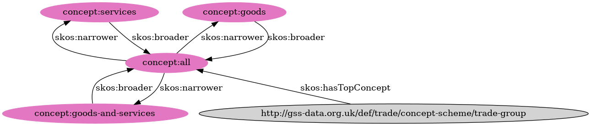

# SPARQL Workshop

## Triples vs Quads

### Triples

Triples have a `subject`, `predicate` and `object`. They can be held in formats like RDF/XML, turtle, n-triples, JSON-LD, etc.

```ttl
<http://gss-data.org.uk/def/concept-scheme/age-groups>
        a <http://www.w3.org/2004/02/skos/core#ConceptScheme> ;
        <http://purl.org/dc/terms/title>  "Age Groups" ;
        <http://www.w3.org/2000/01/rdf-schema#label>  "Age Groups" ;
        <http://www.w3.org/2004/02/skos/core#hasTopConcept>  <http://gss-data.org.uk/def/concept/age-groups/all>.
```

### Quads

Quads have a `subject`, `predicate`, `object` and `graph`. They can be held in formats like Trig, n-quads, etc.

```trig
<http://gss-data.org.uk/def/concept-scheme/age-groups> {
    <http://gss-data.org.uk/def/concept-scheme/age-groups>
            a <http://www.w3.org/2004/02/skos/core#ConceptScheme> ;
            <http://purl.org/dc/terms/title>  "Age Groups" ;
            <http://www.w3.org/2000/01/rdf-schema#label>  "Age Groups" ;
            <http://www.w3.org/2004/02/skos/core#hasTopConcept>  <http://gss-data.org.uk/def/concept/age-groups/all>.
}
```

A `graph` is a collection of triples which has its own URI. It's a useful way to groups triples together within a large triple store like PMD.

## Apache Jena - Command Line Tools

The Apache Jena project has a series of [command line tools](https://jena.apache.org/documentation/tools/index.html) which are useful for running SPARQL queries as well as converting between different RDF formats.

They can be installed with brew:

```bash
brew install jena
```

### `sparql` - execute SPARQL queries

```bash
sparql --data age-groups-code-list.ttl --query select-triples.sparql
```

You'll get a tabular representation of the results back in the console. You can ask `sparql` to return data in a JSON, CSV, or other format (run `sparql --help` for more information).

### `riot` - convert between RDF formats

You can use `riot` to convert between different RDF formats, for example, the following query will convert the turtle in `age-groups-code-list.ttl` into the JSON-LD format of RDF:

```bash
riot --syntax ttl --output json-ld  age-groups-code-list.ttl
```

You can also pipe the results of this conversion process directly into a file, e.g.

```bash
riot --syntax ttl --output json-ld  age-groups-code-list.ttl > age-groups-code-list.json
```

**Note that RIOT cannot convert between triples/quads.**

See [here](https://jena.apache.org/documentation/io/#formats) for supported input/output RDF formats.

## Exercise 1 - Select the name of a Concept Scheme

The intent of this exercise is to primarily make sure you can run basic SPARQL queries using the [Apache Jena Command Line Tools](#apache-jena---command-line-tools) to investigate the contents of a file containing RDF.

| Relevant resources                                            |
|---------------------------------------------------------------|
| [DCATv2](https://www.w3.org/TR/vocab-dcat-2/)                 |
| [SKOS](https://www.w3.org/TR/2009/NOTE-skos-primer-20090818/) |

Given the code list data inside the [age-groups-code-list.ttl](./inputs/age-groups-code-list.ttl) file, write a SPARQL query to return the URI and title/label of the code list.

A good point to start might be to run a [`DESCRIBE` query](https://www.w3.org/TR/sparql11-query/#describe) to investigate the [skos:ConceptScheme](http://www.w3.org/2004/02/skos/core#ConceptScheme), e.g.

```sparql
PREFIX skos: <http://www.w3.org/2004/02/skos/core#>

DESCRIBE ?codeList
WHERE {
    ?codeList a skos:ConceptScheme.
}
```

## More Advanced Pattern Matching

### `OPTIONAL`

[`OPTIONAL` Pattern Matching](https://www.w3.org/TR/sparql11-query/#optionals) allows us to specify that certain patterns we want to match on may or may not exist, and that it's okay if they don't exist.

See <https://github.com/GSS-Cogs/knowledge/wiki/SPARQL#optional-selections> for further examples.

### `FILTER EXISTS`

<https://www.w3.org/TR/sparql11-query/#neg-exists>
TODO

### `FILTER NOT EXISTS`

<https://www.w3.org/TR/sparql11-query/#neg-notexists>
TODO

### `UNION`

<https://www.w3.org/TR/sparql11-query/#alternatives>
TODO

## Exercise 2 - Filtering and Joining

| Relevant resources                                                                           |
|----------------------------------------------------------------------------------------------|
| [SKOS](https://www.w3.org/TR/2009/NOTE-skos-primer-20090818/)                                |
| [Confluence - SKOS Code List Diagrams](https://confluence.ons.gov.uk/display/PHEM/Codelists) |

> 

Given the code list data inside the [age-groups-code-list.ttl](./inputs/age-groups-code-list.ttl) file:

### 2.a Top Concepts

Write a SPARQL query to find all of the [skos:Concept](http://www.w3.org/2004/02/skos/core#Concept)s which don't have any [skos:broader](http://www.w3.org/2004/02/skos/core#broader) related concepts. These concepts are at the top of the concept scheme.

### 2.b Bottom Concepts

Write a SPARQL query to find all of the [skos:Concept](http://www.w3.org/2004/02/skos/core#Concept)s which don't have any [skos:narrower](http://www.w3.org/2004/02/skos/core#narrower) related concepts. These concepts are at the bottom of the concept scheme.

### 2.c Middle Concepts

Write a SPARQL query to find all of the [skos:Concept](http://www.w3.org/2004/02/skos/core#Concept)s which have both [skos:narrower](http://www.w3.org/2004/02/skos/core#narrower) and [skos:broader](http://www.w3.org/2004/02/skos/core#narrower) concepts. These concepts are in the middle of the concept scheme.

### 2.d All Concepts

Write a SPARQL query which lists all of the concepts at the top, in the middle, and at the bottom of the hierarchy **along with their position**, i.e. `Top`, `Middle` or `Bottom` respectively.

Note that you may find it useful to use the [BIND](https://www.w3.org/TR/sparql11-query/#bind) function to deliniate which rows come from the top, middle and bottom of the concept scheme.

Hint: There is more than one way to write this query.

## `GROUP BY`

[GROUP BY](https://www.w3.org/TR/sparql11-query/#groupby)

There are a set of aggregate functions which you can run across grouped results. They can be found in the [aggregates](https://www.w3.org/TR/sparql11-query/#aggregates) section of W3C's SPARQL 1.1 documentation.

COUNT, SUM, MIN, MAX, AVG, GROUP_CONCAT, and SAMPLE.

## Property Paths

[Property Paths](https://www.w3.org/TR/sparql11-query/#propertypaths)

## Exercise 3

| Relevant resources                                            |
|---------------------------------------------------------------|
| [SKOS](https://www.w3.org/TR/2009/NOTE-skos-primer-20090818/) |

Given the code list data inside the [age-groups-code-list.ttl](./inputs/age-groups-code-list.ttl) file write a query which lists each concepts in the concept scheme and the number of children it has (including children of children).

Note that you should **not** try to include concepts which have no children in this query.

Hint:

| concept                                             | numConcepts |
|-----------------------------------------------------|-------------|
| <http://gss-data.org.uk/def/concept/age-groups/all> | 206         |

## Graphs

Given the large number of data sets stored on PMD, triples are grouped together into [graphs](https://www.w3.org/TR/sparql11-query/#restrictByLabel) to help us partition the data. The triples within a particular graph can be explored in a query as follows:

```sparql
# This query should be executed against https://beta.gss-data.org.uk/tools/sparql

SELECT *
WHERE {
    GRAPH <http://gss-data.org.uk/graph/gss_data/trade/ons-exports-of-services-by-country-by-modes-of-supply> {
        ?s ?p ?o.
    }
}
LIMIT 100 # Limit the number of rows returned.
```

Each data set and code list that we upload to PMD is stored in its own graph. It is possible to find out which graph a triple is stored in with a query like the following:

```sparql
# This query should be executed against https://beta.gss-data.org.uk/tools/sparql

PREFIX qb: <http://purl.org/linked-data/cube#>

SELECT ?graphIdentifier
WHERE {
    GRAPH ?graphIdentifier {
        <http://gss-data.org.uk/data/gss_data/trade/ons-exports-of-services-by-country-by-modes-of-supply#dataset> a qb:DataSet.
    }
}
```

Which returns the following result:

| graphIdentifier                                                                                     |
|-----------------------------------------------------------------------------------------------------|
| <http://gss-data.org.uk/graph/gss_data/trade/ons-exports-of-services-by-country-by-modes-of-supply> |

## Exercise 4

| Relevant resoureces                                     |
|---------------------------------------------------------|
| [RDF Data Cube](https://www.w3.org/TR/vocab-data-cube/) |

> This exercise should be executed against the [PMD Beta Service's SPARQL Endpoint](https://beta.gss-data.org.uk/tools/sparql).

For the remainder of this exercise, you should make sure that all of your triple patterns are restricted to the <http://gss-data.org.uk/graph/gss_data/trade/ons-exports-of-services-by-country-by-modes-of-supply> graph to ensure reasonable performance.

### 4.a - Counting observations

Count the number of [qb:Observation](http://purl.org/linked-data/cube#Observation)s in the data set.

### 4.b - Filtering data

We're going to do some aggregation, so we need to remove some pre-aggregated values from the data to avoid double counting.

Write a query to select all observed values which do not have the [mode](http://gss-data.org.uk/data/gss_data/trade/ons-exports-of-services-by-country-by-modes-of-supply#dimension/mode) of [`Total of Remote Trade and Consumption Abroad and Presence of Natural Persons (modes 1 2 4)`](https://beta.gss-data.org.uk/resource?uri=http%3A%2F%2Fgss-data.org.uk%2Fdata%2Fgss_data%2Ftrade%2Fons-exports-of-services-by-country-by-modes-of-supply%23concept%2Fmode%2Ftotal-modes-1-2-and-4).

The [sameTerm filter function](https://www.w3.org/TR/sparql11-query/#func-sameTerm) may be helpful here.

### 4.c - Aggregating data

Extend the query you wrote in [4.b](#4b---filtering-data) so that shows the aggregate sum of trade broken down by each [country](http://gss-data.org.uk/data/gss_data/trade/ons-exports-of-services-by-country-by-modes-of-supply#dimension/country) and the [trade flow direction](http://gss-data.org.uk/def/trade/property/dimension/flow-directions) (imports/exports).

Compare your values against the values we exluded from our query in 4.b; are there any differences?

## `VALUES`

[VALUES](https://www.w3.org/TR/sparql11-query/#inline-data)
TODO

## Exercise 5

> This exercise should be executed against the [PMD Beta Service's SPARQL Endpoint](https://beta.gss-data.org.uk/tools/sparql).

Write a SPARQL query to find the data set listed in [dataset-uris.csv](./inputs/dataset-uris.csv) which has the most observations.

## Random Links

[BIND](https://www.w3.org/TR/sparql11-query/#bind)

[CONSTRUCT](https://www.w3.org/TR/sparql11-query/#construct)
[ASK](https://www.w3.org/TR/sparql11-query/#ask)
[COALESCE](https://www.w3.org/TR/sparql11-query/#func-coalesce)
[Sub-queries](https://www.w3.org/TR/sparql11-query/#subqueries)
[Useful Functions](https://www.w3.org/TR/sparql11-query/#func-rdfTerms)
[Functions on Strings](https://www.w3.org/TR/sparql11-query/#func-strings)
[RDF Lists](https://www.w3.org/TR/sparql11-query/#collections)
[IN](https://www.w3.org/TR/sparql11-query/#func-in)
[NOT IN](https://www.w3.org/TR/sparql11-query/#func-not-in)

## Useful links

* <https://github.com/GSS-Cogs/knowledge/wiki/SPARQL>
* <https://github.com/GSS-Cogs/knowledge/wiki/Introduction-to-RDF>
